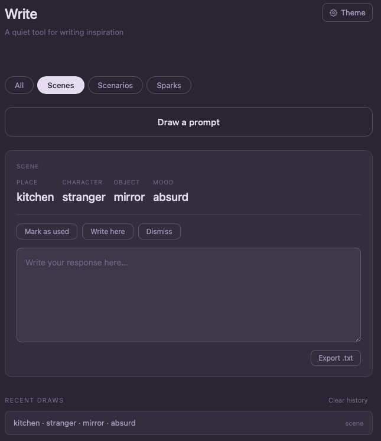

# Write Lite

A quiet tool for writing inspiration. No accounts, no setup, no server — just open the file and go. Everything saves to your browser's IndexedDB automatically.

   

---

## What it does

Draw a writing prompt from three categories, write a response inline, and export it as a plain text file. That's it. No noise, no gamification, no onboarding.

---

## Prompt categories

### Scenes
One word per slot — place, character, object, mood — rendered as a labeled word set. Good for drama exercises and quick scene-setting.

### Scenarios
A combinatorial sentence built from protagonist, situation, setting, and complication slots. Each draw produces a unique story setup.

### Sparks
Five random words from a curated pool. No structure, no prose — just raw material to ignite something.

---

## Features

- **Weighted draw** — recently drawn values are deprioritized so repeats are rare
- **Three categories** — draw from all, or filter to Scenes, Scenarios, or Sparks
- **Write here** — toggleable textarea inline with the prompt
- **Export .txt** — saves your prompt and writing to a dated plain text file
- **Mark as used / Dismiss** — track what you've worked with
- **Recent draws** — history panel showing your last 10 draws
- **Five themes** — Warm Parchment, Soft Sage, Dusty Slate, Muted Dusk, Deep Ink
- **Persistent** — draw history and theme choice survive page reloads via IndexedDB and localStorage
- **Single file** — one `write.html`, no build tools, no frameworks, no backend



---

## Setup

No setup required. Download `write.html` and open it in any browser.

To get full persistence (draw history and weighted counts), open it via a local server or host it online rather than opening the file directly — IndexedDB works in both cases, but some browsers restrict it for `file://` URLs.

```bash
# Serve locally with Python
python3 -m http.server 8080
# Then open http://localhost:8080/write.html
```

---

## Themes

| Theme | Feel |
|---|---|
| Warm parchment | Cream and amber — soft daylight writing |
| Soft sage | Pale green — calm and natural |
| Dusty slate | Cool grey-blue — quiet and focused |
| Muted dusk | Deep plum — late-night writing energy |
| Deep ink | Near-black with amber gold — sharp contrast |

Theme choice is saved to localStorage and restored on next open.

---

## Difference from the PWA version

| Feature | Write (this) | Write PWA |
|---|---|---|
| Single HTML file | ✓ | — |
| Three prompt categories | ✓ | ✓ |
| Five colour themes | ✓ | ✓ |
| Write area + export | ✓ | ✓ |
| Draw history | ✓ | ✓ |
| IndexedDB persistence | ✓ | ✓ |
| Installs to home screen | — | ✓ |
| Works fully offline | — | ✓ |
| PWA manifest + service worker | — | ✓ |

The standalone version is ideal for local use, sharing, or dropping into an existing project. The PWA version is built for daily use as an installed app on iPad or desktop.

---

## Stack

No frameworks. No build step. No package manager.

- Vanilla HTML, CSS, JavaScript
- IndexedDB for draw history and weighted counts
- localStorage for theme preference
- System font stack — no external fonts

---

*Built with [Claude](https://claude.ai) — AI-assisted development.*
